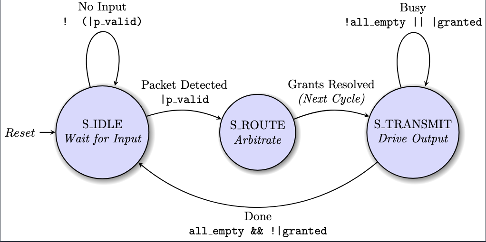
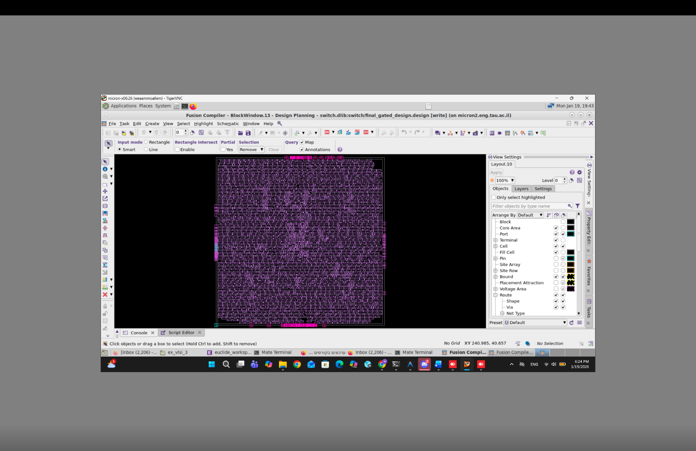
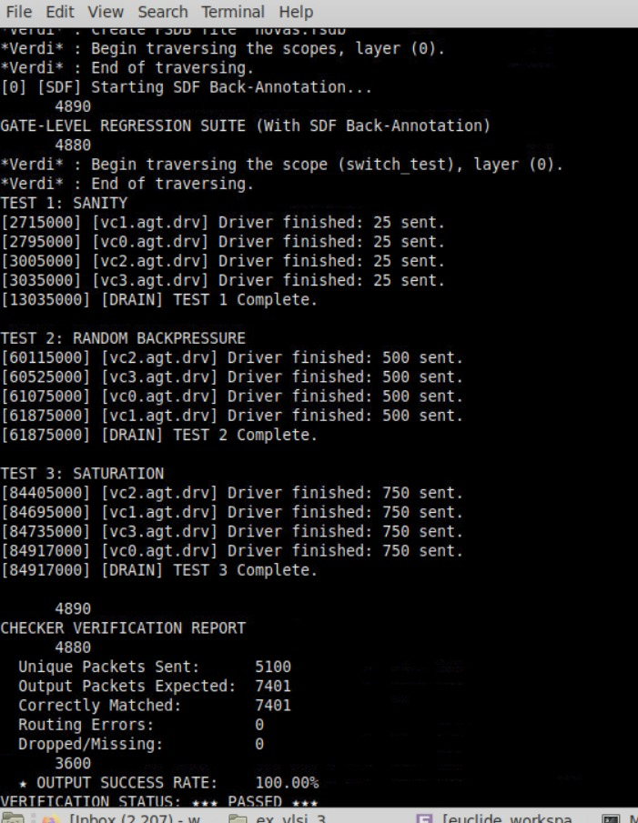

# Four-Port Packet Switch

SystemVerilog design, verification, and implementation project for a 4-port packet switch. The design routes unicast, multicast, and broadcast packets between four ports using ready/valid flow control, per-port buffering, and round-robin arbitration.

This repository is organized as a three-stage hardware project:

- **Part A - RTL Design:** Initial packet switch RTL, packet definitions, interface, and directed testing.
- **Part B - Functional Verification:** Class-based SystemVerilog verification environment with constrained random traffic, drivers, monitors, sequencers, agents, scoreboard/checker, and functional coverage.
- **Part C - Implementation:** Gate-level implementation artifacts, timing/power/area/QoR reports, clock-gating results, netlist, SDF, and post-synthesis simulation log.

## Project Highlights

- 4x4 packet switch with parameterized top-level structure.
- Supports unicast, multicast, and broadcast traffic.
- Prevents self-routing by masking the source port from the destination mask.
- Uses round-robin arbitration to reduce starvation under contention.
- Includes ready/valid flow control and backpressure handling.
- Verification includes random backpressure, saturation, hotspot, broadcast, FIFO-full, and long-run stress scenarios.
- Gate-level regression with SDF back-annotation passed successfully.

## Visual Overview

### High-Level Architecture


### FSM Control Logic



### Implementation View



### Gate-Level Simulation Result



## Repository Structure

```text
.
├── part_a_design/
│   ├── packet_pkg.sv
│   ├── packet_data.sv
│   ├── port_if.sv
│   ├── switch_port.sv
│   ├── switch_4port.sv
│   ├── testForStageA.sv
│   └── Part A subbmission.pdf
├── part_b_verification/
│   ├── packet_pkg.sv
│   ├── packet_data.sv
│   ├── component_base.sv
│   ├── sequencer.sv
│   ├── driver.sv
│   ├── monitor.sv
│   ├── agent.sv
│   ├── packet_vc.sv
│   ├── checker.sv
│   ├── port_if.sv
│   ├── switch_port.sv
│   ├── switch_4port.sv
│   ├── vc_test.sv
│   ├── switch_test.sv
│   ├── run.f
│   └── Project Report_ Stage B - Verification .pdf
└── part_c_implementation/
    ├── switch_4port.sv
    ├── switch_test.sv
    ├── switch_4port_netlist.v
    ├── switch_4port.sdf
    ├── run.tcl
    ├── simulation.log
    ├── area_*.txt
    ├── power_*.txt
    ├── timing_*.txt
    ├── qor_*.txt
    ├── clock_gating_details.txt
    └── Four-Port Switch Project_.pdf
```

## Design Overview

The switch has four independent input/output ports. Each port accepts packets with:

- `source`: one-hot encoded source port
- `target`: destination mask
- `data`: 8-bit payload

The top-level switch aggregates the four port interfaces, calculates effective destination masks, arbitrates requests per output port, and tracks pending multicast destinations until all required outputs are served.

## Verification Overview

The Part B environment is a class-based SystemVerilog verification setup. It includes:

- Transaction classes for unicast, multicast, and broadcast packets.
- Sequencers for randomized and directed packet generation.
- Drivers and monitors for each port.
- Agents and virtual components for reusable per-port verification.
- A checker/scoreboard that compares expected routed packets against observed outputs.
- Functional coverage for packet types, FIFO utilization, ready/backpressure behavior, and cross coverage.

The main regression in `part_b_verification/switch_test.sv` includes:

1. Sanity test
2. Random backpressure
3. Saturation stress
4. Long-run stability
5. Rotating hotspot traffic
6. Broadcast storm
7. FIFO jam / full-buffer test

## Results

Post-implementation gate-level simulation with SDF back-annotation completed successfully:

| Metric | Result |
| --- | ---: |
| Unique packets sent | 5,100 |
| Output packets expected | 7,401 |
| Correctly matched packets | 7,401 |
| Routing errors | 0 |
| Dropped/missing packets | 0 |
| Output success rate | 100.00% |
| Functional coverage | 100.00% |

Implementation summary:

| Metric | No Clock Gating | With Clock Gating |
| --- | ---: | ---: |
| Total cell area | 25,118.83 | 25,222.78 |
| Leaf cell count | 4,267 | 4,298 |
| Critical path slack, slow clk | 0.01 ns | 0.07 ns |
| Critical path slack, fast clk | 0.37 ns | 0.42 ns |
| Total dynamic power | 1.58e+08 pW | 1.55e+08 pW |
| Clock-gating cells | 141 | 153 |
| Gated registers | - | 2,196 / 2,202 |

## How to Run

The verification file list is provided in `part_b_verification/run.f`.

Example VCS-style flow:

```bash
cd part_b_verification
vcs -sverilog -f run.f -full64 -debug_access+all
./simv
```

For implementation and gate-level simulation artifacts, see `part_c_implementation/run.tcl`, `switch_4port_netlist.v`, `switch_4port.sdf`, and `simulation.log`.

## Tools Used

- SystemVerilog RTL
- SystemVerilog class-based verification
- Synopsys VCS / Verdi simulation flow
- Synopsys Fusion Compiler implementation flow

## Author

Created by Weaam Muollem as part of a digital design, verification, and implementation project.
