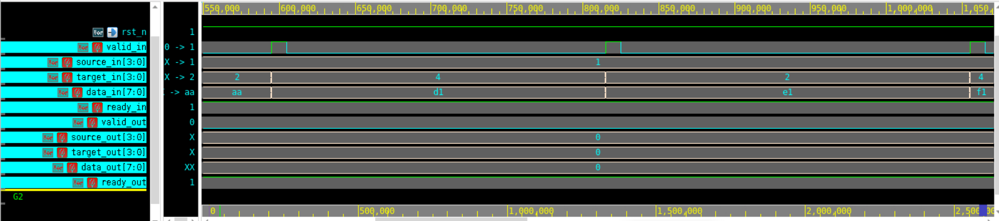
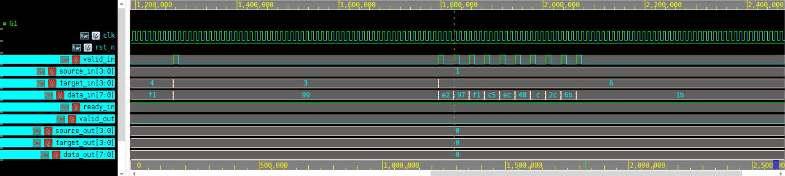

# Four-Port Packet Switch

SystemVerilog design, verification, and implementation project for a 4-port packet switch. The design routes unicast, multicast, and broadcast packets between four ports using ready/valid flow control, per-port buffering, and round-robin arbitration.

This repository is organized as a three-stage hardware project:

- **Part A - RTL Design:** Initial packet switch RTL, packet definitions, interface, and directed testing.
- **Part B - Functional Verification:** Class-based SystemVerilog verification environment with constrained random traffic, drivers, monitors, sequencers, agents, scoreboard/checker, and functional coverage.
- **Part C - Implementation:** Gate-level implementation artifacts, timing/power/area/QoR reports, clock-gating results, netlist, SDF, and post-synthesis simulation log.

## Project Highlights

- 4x4 packet switch with parameterized top-level structure.
- Supports unicast, multicast, and broadcast traffic.
- Prevents self-routing by masking the source port from the destination mask.
- Uses round-robin arbitration to reduce starvation under contention.
- Includes ready/valid flow control and backpressure handling.
- Verification includes random backpressure, saturation, hotspot, broadcast, FIFO-full, and long-run stress scenarios.
- Gate-level regression with SDF back-annotation passed successfully.

## Repository Structure

```text
.
|-- assets/
|   |-- architecture_block_diagram.png
|   |-- fsm_control_diagram.png
|   |-- stage_a_port0_waveform_X31.png
|   |-- stage_a_port0_waveform_X32.png
|   |-- stage_a_port0_waveform_X33.png
|   |-- functional_coverage_100_percent.png
|   |-- implementation_qor_summary.png
|   `-- gate_level_simulation_success.png
|-- part_a_design/
|   |-- packet_pkg.sv
|   |-- packet_data.sv
|   |-- port_if.sv
|   |-- switch_port.sv
|   |-- switch_4port.sv
|   |-- testForStageA.sv
|   `-- Part A subbmission.pdf
|-- part_b_verification/
|   |-- packet_pkg.sv
|   |-- packet_data.sv
|   |-- component_base.sv
|   |-- sequencer.sv
|   |-- driver.sv
|   |-- monitor.sv
|   |-- agent.sv
|   |-- packet_vc.sv
|   |-- checker.sv
|   |-- port_if.sv
|   |-- switch_port.sv
|   |-- switch_4port.sv
|   |-- vc_test.sv
|   |-- switch_test.sv
|   |-- run.f
|   `-- Project Report_ Stage B - Verification .pdf
`-- part_c_implementation/
    |-- switch_4port.sv
    |-- switch_test.sv
    |-- switch_4port_netlist.v
    |-- switch_4port.sdf
    |-- run.tcl
    |-- simulation.log
    |-- area_*.txt
    |-- power_*.txt
    |-- timing_*.txt
    |-- qor_*.txt
    |-- clock_gating_details.txt
    `-- Four-Port Switch Project_.pdf
```

## Design Overview

The switch has four independent input/output ports. Each port accepts packets with:

- `source`: one-hot encoded source port
- `target`: destination mask
- `data`: 8-bit payload

The top-level switch aggregates the four port interfaces, calculates effective destination masks, arbitrates requests per output port, and tracks pending multicast destinations until all required outputs are served.

The diagram below comes directly from the Stage A report and shows the high-level data flow from the test environment, through the per-port FIFOs, and into the central routing logic.


The control path is built around an FSM with idle, route, and transmit states, coordinated with round-robin arbitration and output steering.


### Stage A Waveform Validation

The Stage A report includes Port 0 waveform validation, showing signal-level behavior for valid/ready handshaking, source and target routing, payload transfer, and output response.






## Verification Overview

The Part B environment is a class-based SystemVerilog verification setup. It includes:

- Transaction classes for unicast, multicast, and broadcast packets.
- Sequencers for randomized and directed packet generation.
- Drivers and monitors for each port.
- Agents and virtual components for reusable per-port verification.
- A checker/scoreboard that compares expected routed packets against observed outputs.
- Functional coverage for packet types, FIFO utilization, ready/backpressure behavior, and cross coverage.

The main regression in `part_b_verification/switch_test.sv` includes:

1. Sanity test
2. Random backpressure
3. Saturation stress
4. Long-run stability
5. Rotating hotspot traffic
6. Broadcast storm
7. FIFO jam / full-buffer test

The Stage B RTL regression reached 100% output success and 100% functional coverage, with 16,300 unique packets sent and 23,676 expected output packets matched without routing errors or dropped packets.


## Results

Post-implementation gate-level simulation with SDF back-annotation completed successfully:


| Metric | Result |
| --- | ---: |
| Unique packets sent | 5,100 |
| Output packets expected | 7,401 |
| Correctly matched packets | 7,401 |
| Routing errors | 0 |
| Dropped/missing packets | 0 |
| Output success rate | 100.00% |
| Functional coverage | 100.00% |

Implementation summary:

| Metric | No Clock Gating | With Clock Gating |
| --- | ---: | ---: |
| Total cell area | 25,118.83 | 25,222.78 |
| Leaf cell count | 4,267 | 4,298 |
| Critical path slack, slow clk | 0.01 ns | 0.07 ns |
| Critical path slack, fast clk | 0.37 ns | 0.42 ns |
| Total dynamic power | 1.58e+08 pW | 1.55e+08 pW |
| Clock-gating cells | 141 | 153 |
| Gated registers | - | 2,196 / 2,202 |

The implementation report also includes a Fusion Compiler view of the final design layout.


## How to Run

The verification file list is provided in `part_b_verification/run.f`.

Example VCS-style flow:

```bash
cd part_b_verification
vcs -sverilog -f run.f -full64 -debug_access+all
./simv
```

For implementation and gate-level simulation artifacts, see `part_c_implementation/run.tcl`, `switch_4port_netlist.v`, `switch_4port.sdf`, and `simulation.log`.

## Tools Used

- SystemVerilog RTL
- SystemVerilog class-based verification
- Synopsys VCS / Verdi simulation flow
- Synopsys Fusion Compiler implementation flow

## Image Sources

The README images were extracted directly from the submitted PDF reports:

- `architecture_block_diagram.png`: Part A report, page 3
- `fsm_control_diagram.png`: Part A report, page 5
- `stage_a_port0_waveform_X31.png`, `stage_a_port0_waveform_X32.png`, `stage_a_port0_waveform_X33.png`: Part A report, page 10
- `functional_coverage_100_percent.png`: cropped from Stage B verification report, page 7
- `implementation_qor_summary.png`: Part C implementation report, page 11
- `gate_level_simulation_success.png`: Part C implementation report, page 14

## Author

Created by Weaam Muollem as part of a digital design, verification, and implementation project.
