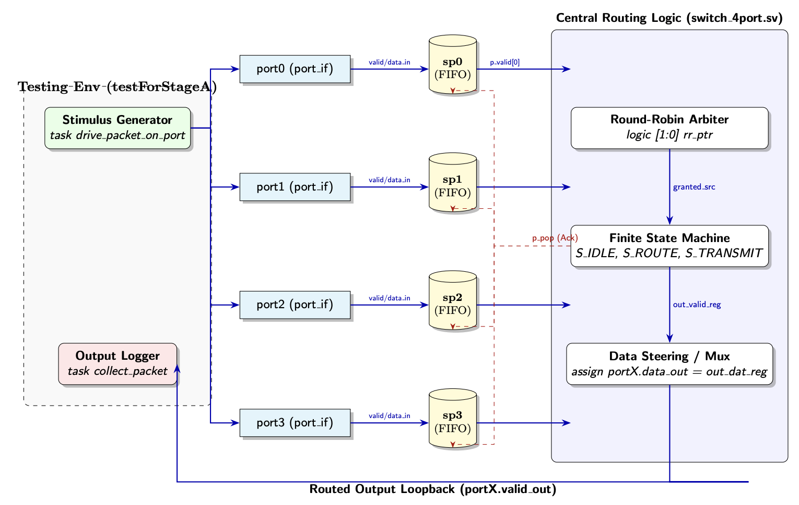
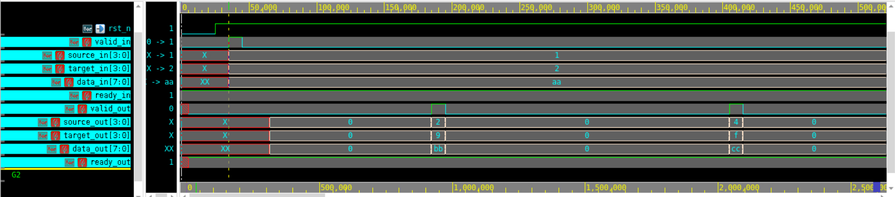

# Design Overview

## Goal

The design implements a 4-port packet switch. Each packet contains a source port, a destination mask, and an 8-bit payload. The switch supports unicast, multicast, and broadcast routing.

## Packet Fields

| Field | Width | Description |
| --- | ---: | --- |
| `source` | 4 bits | One-hot source port |
| `target` | 4 bits | Destination mask |
| `data` | 8 bits | Packet payload |

## Architecture

Each input port has local buffering. The top-level switch collects valid packets from the four ports, calculates the effective destination mask, arbitrates requests for each output, and drives the selected output data.

## Control Flow

The routing logic is controlled by an FSM with idle, route, and transmit behavior. Round-robin arbitration is used when multiple input ports request the same output port.

## Important Design Choices

- Per-port buffering reduces packet loss during bursts.
- Ready/valid handshaking supports backpressure.
- Round-robin arbitration improves fairness under contention.
- Source masking prevents a packet from being routed back to its own source port.
- Pending-mask tracking allows multicast packets to be delivered across multiple outputs.

## Stage A Waveform Validation

The Stage A report includes signal-level waveform validation for Port 0. The waveform demonstrates valid/ready behavior, source/target routing, payload transfer, and output response.

