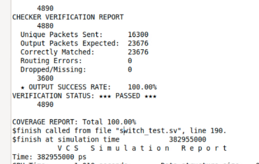

# Verification Overview

## Verification Environment

The Stage B environment is a class-based SystemVerilog verification environment. It is organized around reusable verification components for each switch port.

## Main Components

| File | Role |
| --- | --- |
| `packet_data.sv` | Packet classes and constraints |
| `sequencer.sv` | Random and directed packet generation |
| `driver.sv` | Drives packets into the DUT |
| `monitor.sv` | Observes output packets and backpressure |
| `agent.sv` | Groups sequencer, driver, and monitor |
| `packet_vc.sv` | Reusable per-port verification component |
| `checker.sv` | Scoreboard/checker |
| `switch_test.sv` | Top-level regression |

## Test Plan

The regression covers:

1. Sanity traffic
2. Random backpressure
3. Saturation stress
4. Long-run stability
5. Rotating hotspot traffic
6. Broadcast storm
7. FIFO jam / full-buffer behavior

## Scoreboard Strategy

The checker builds expected output queues from the driven input packets. For multicast and broadcast packets, one input packet can generate multiple expected output packets. The monitors collect actual output packets and the checker compares them against the expected queues.

## RTL Regression Result

| Metric | Result |
| --- | ---: |
| Unique packets sent | 16,300 |
| Output packets expected | 23,676 |
| Correctly matched packets | 23,676 |
| Routing errors | 0 |
| Dropped/missing packets | 0 |
| Output success rate | 100.00% |
| Functional coverage | 100.00% |

## Coverage Notes

The coverage model tracks packet type, FIFO utilization, ready/backpressure behavior, and cross coverage between flow-control and buffer-state conditions.
